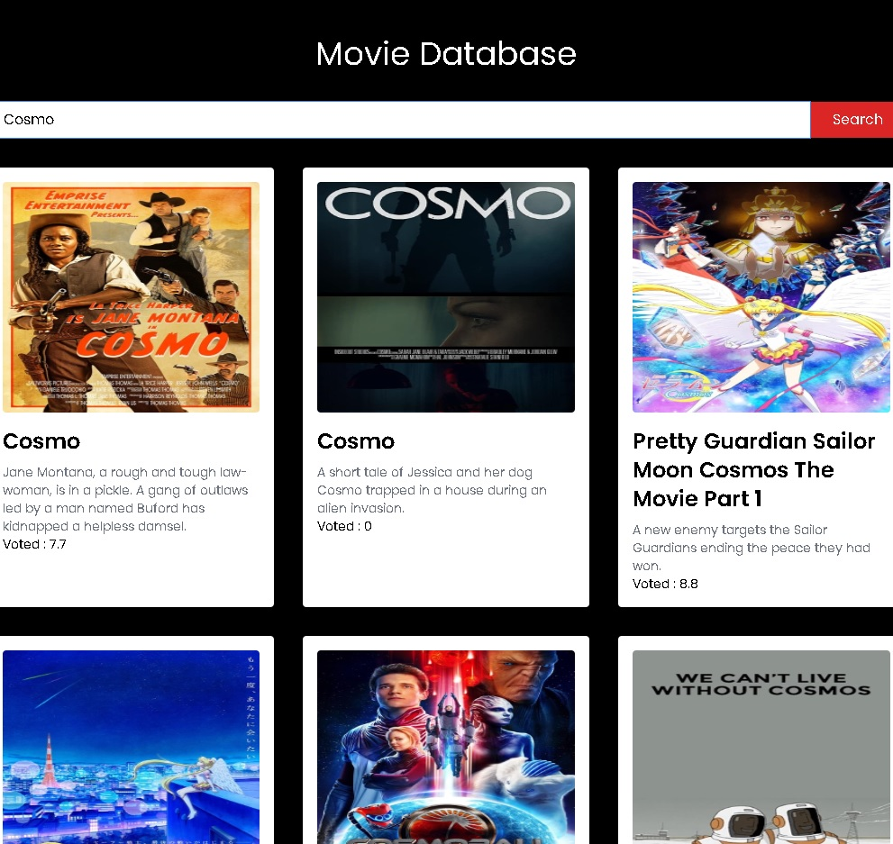

# Movie_Base_Nextjs

An API project I had fun with to make. To learn about Next.js , Tailwind and Typescript. Nice to look up movies by name see the Movieposters amd votes.


View the app: 
[MovieBase](https://moviebase-nextjs.netlify.app)


## Table of Contents

- [Project Name](#project-name)
  - [Table of Contents](#table-of-contents)
  - [Introduction](#introduction)
  - [Features](#features)
  - [Getting Started](#getting-started)
    - [Prerequisites](#prerequisites)
    - [Installation](#installation)
  - [Usage](#usage)
  - [Folder Structure](#folder-structure)
  - [Contributing](#contributing)
  - [License](#license)
  - [Acknowledgments](#acknowledgments)




## Introduction

Provide a brief introduction or overview of your project. What does it do, and why is it useful?

## Features

- List key features or functionalities of your project.
- Use bullet points to make it easy to read.

## Getting Started

Provide instructions on how to get your project up and running on a user's local machine. Include any prerequisites and installation steps.

### Prerequisites

List any software, tools, or dependencies that users need to have installed before they can use your project.

### Installation

Provide detailed step-by-step instructions for installing and configuring your project. Include code snippets if necessary.

```bash
# Example installation steps
git clone https://github.com/your-username/your-repo-name.git
cd your-repo-name
npm install

